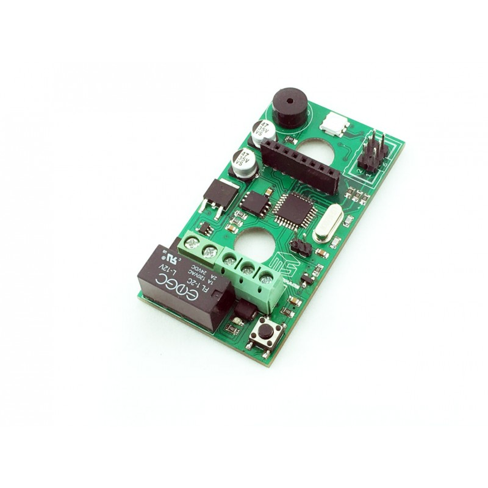

RFID Microcontroller Board

For more details, check out the product pages at

http://makerstorage.com/index.php?id_product=25&controller=product

MakerStorage invests time and resources providing this open source design, please support MakerStorage and open-source hardware by purchasing products from MakerStorage!

Designed by MakerStorage LLC.

Credits:

The firmware is based on Omer Siar Baysal. https://github.com/omersiar/RFID522-Door-Unlock

Creative Commons Attribution, Share-Alike license, check https://creativecommons.org/licenses/by-sa/3.0/ for more information All text above must be included in any redistribution